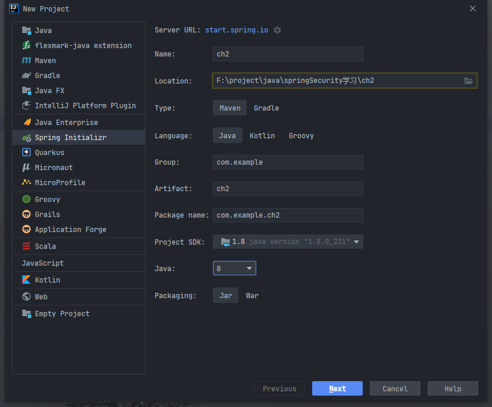
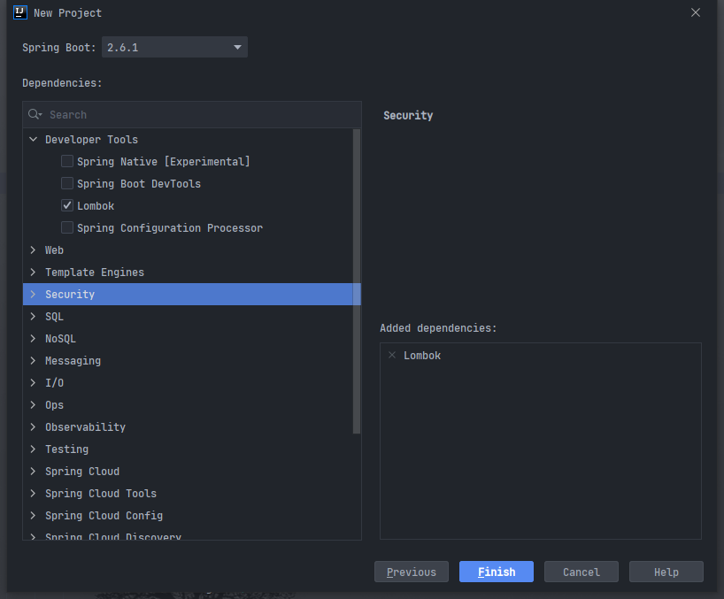
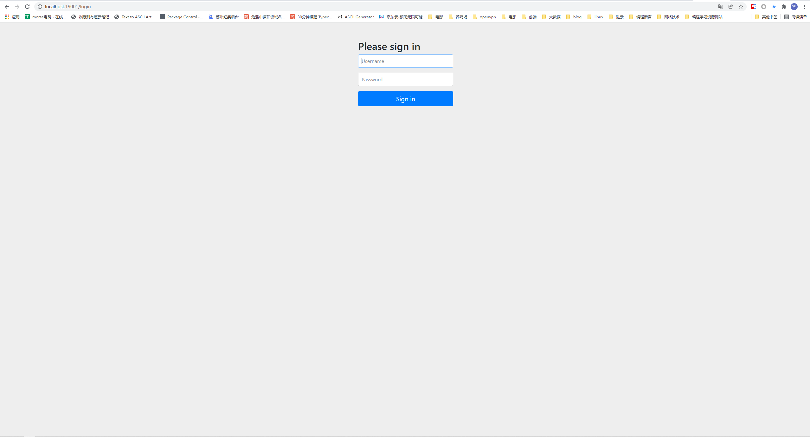
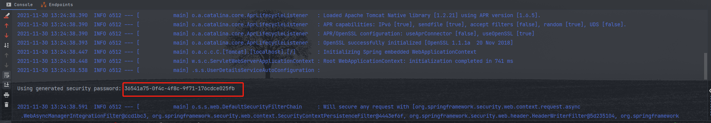

# 第一个Spring Security 程序
## 实现步骤
1. 创建`Spring boot`工程
2. 导入`Spring Security`依赖
3. 编写`applicaion.yaml`配置文件
4. 编写`HelloController`
5. 编写`Spring Security Config`配置文件
6. 测试

## 具体实现
### 创建`Springboot`项目
idea中：`File` -> `new` -> `project` -> `Spring Initializr`  
  
点击`next`  

点击`Finish`

### 导入`Spring Security` 依赖
在`pom.xml`中新增 `Spring Security`依赖  
```xml
<!-- 这里没有写版本，因为我们的pom继承了spring boot pom -->
<dependency>
    <groupId>org.springframework.boot</groupId>
    <artifactId>spring-boot-starter-security</artifactId>
</dependency>
```

### 编写`application.yaml`配置文件  
1. 删除原有的`resource/application.properties`文件
2. 在`resource`文件夹下创建`application.yaml`文件
3. 编写`application.yaml`文件
```yaml
server:
  port: 19001
  servlet:
    encoding:
      charset: UTF-8
spring:
  application:
    name: ch2
```

### 编写`HelloController`
1. 在`Application`启动类同级创建`controller`包
2. 在`controller`包下创建`HelloController`
```java
@RequestMapping("/hello")
@RestController
public class HelloController {

    @GetMapping("/say")
    public String say(){
        return "Hello World";
    }

}
```

***到目前为止，可以启动项目，访问`http://localhost:19001/hello/say`查看接口返回***
可以看到页面展示`Hello World`  

### 编写`Spring Security`配置文件  
1. 在`controller`包同级创建`config`包  
2. 在`config`包下创建`SecurityConfig`类
```java
@EnableWebSecurity(debug = true)
public class SecurityConfig extends WebSecurityConfigurerAdapter {
    @Override
    protected void configure(AuthenticationManagerBuilder auth) throws Exception {
        super.configure(auth);
    }

    @Override
    protected void configure(HttpSecurity http) throws Exception {
        super.configure(http);
    }

    /**
     * 不启用过滤器链，允许或拒绝
     * 例如：
     *      1. 过滤静态资源请求
     *
     * @param web
     * @throws Exception
     */
    @Override
    public void configure(WebSecurity web) throws Exception {
        super.configure(web);
    }


}
```
我们再次请求`http://localhost:19001/hello/say`发现会有一个登录界面  
  
Spring Security 默认用户名是 user  
password 会在控制台打印出来
  
登录之后我们发现就可以正常访问接口了  


## 自定义用户名和密码
**在上面的示例中我们已经知道了`Spring Security`的默认用户名是`user`密码是随机的，会在控制台中输出，那么我们怎么自定义用户名和密码呢**

编辑`pom.xml`
```yaml
spring:
  application:
    name: ch2
  # Spring security 配置用户名密码和角色，用于演示系统或者搭建原型的时候使用
  security:
    user:
      name: user
      password: 12345678
      # 设置用户拥有的角色
      roles:  USER,ADMIN
```
**重启应用，我们就可以使用定义的用户名密码登录了**

## 补充
在`SecurityConfig`中，我们用到了`@EnableWebSecurity`注解,它有一个属性`debug`默认是为`false`的，我们可以设置为`true`。这样我们可以在控制台看到`Spring Security`实现的一些细节
在`application.yaml`中新增如下配置：
```yaml
logging:
  level:
    org.springframework.security: debug
```