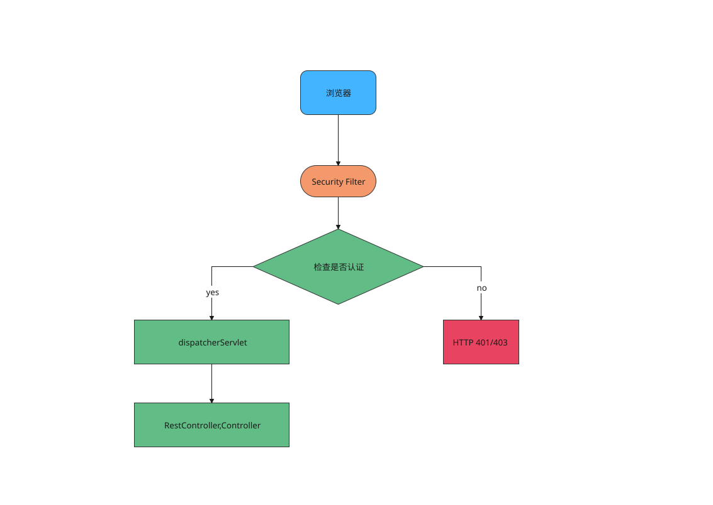
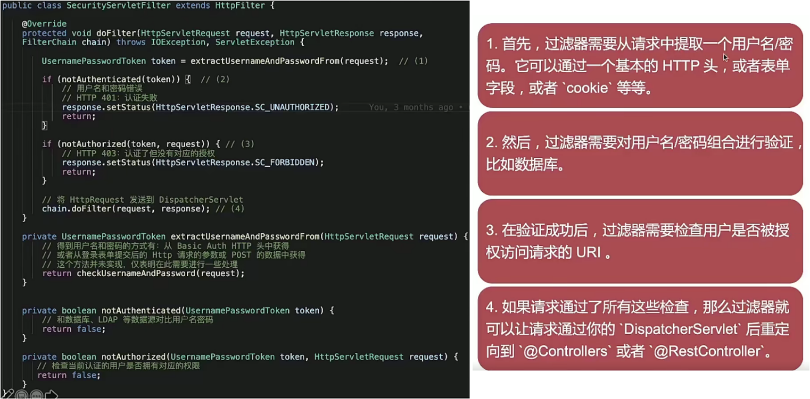
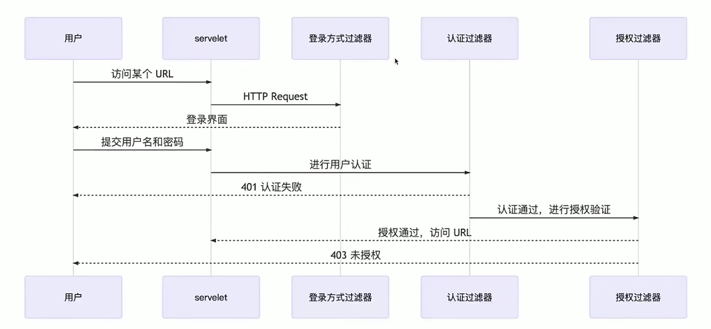

<!--more-->

# 过滤器和过滤器链 
> 任何 `Spring Web`应用本质上都是 `Servlet`
> `Security Filter`会在`HTTP`请求到达`Controller`之前，过滤每一个进来的`HTTP`请求

## 过滤器示例
  

### 常见内建过滤器
***BasicAuthenticationFilter:*** 如果在请求中找到一个 Basic Auth Http 头，则尝试用该头中的用户名和密码认证用户  
***UsernamePasswordAuthenticationFilter:*** 如果在请求参数或者 POST 的 Request body 中找到 用户名/密码，则尝试用这些值对用户进行身份认证  
***DefaultLoginPageGeneratingFilter:*** 默认登录页面生成过滤器，用于生成一个登录页面，如果你没有明确地禁用这个功能，那么就会生成一个登录页面。这就是为什么在启用`Spring Security`时，会得到一个默认的登录界面。   
***DefaultLogoutPageGeneratingFilter:*** 如果没有禁用该功能，则会生成一个默认的注销页面。  
***FilterSecurityInterceptor:*** 过滤安全拦截，用于授权逻辑  

## 过滤器链
> 在`Spring Security`中，每个过滤器处理自己的事情，比如认证过滤器、授权过滤器等等。`Spring Security`将他们串成一个链，也就是`过滤器链`

过滤器链的优势：符合单一职责原则，职责比较单一

